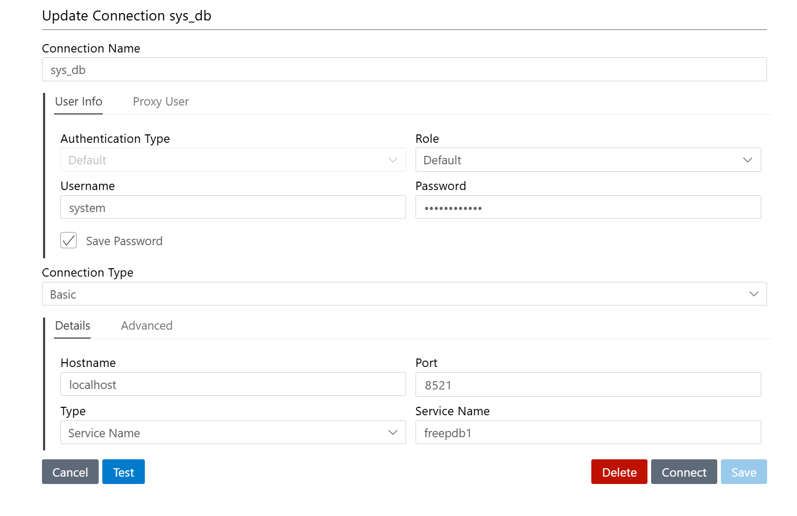

# Oracle 23ai Database on Docker

This project sets up an Oracle 23ai Database using Docker Compose. It's a great way for developers to explore the latest Oracle Database features.

## Prerequisites

- Docker and Docker Compose installed on your system
- At least 8GB of RAM available for the container

## Setup and Running

1. Clone this repository or copy the `docker-compose.yml` file to your local machine.

2. Open a terminal and navigate to the directory containing the `docker-compose.yml` file.

3. Start the Oracle 23ai Database container:
   ```
   docker-compose up -d   
   ```

   This command will download the Oracle 23ai image (if not already present) and start the container in detached mode.

4. Wait for the container to fully start. This may take a few minutes. You can check the logs with:
   ```
   docker-compose logs -f   
   ```

5. Once the container is running, you can connect to the database using SQL*Plus, SQL Command Line, or VS Code with the Oracle SQL Developer extension.

## Connecting to the Database

### Using Docker Command Line

To connect to the database through the command line, follow these steps:

1. Open a terminal window.

2. Run the following command to open a bash shell in the running Oracle container:
   ```
   docker exec -it oracle-23ai bash
   ```

3. Once inside the container, you can connect to the database using SQL*Plus:
   ```
   sqlplus system/SysPassword1@//localhost/FREEPDB1
   ```

### Using SQL Command Line (if installed on your host machine)

```
sql system/SysPassword1@//localhost/FREEPDB1
```

### Using SQL*Plus (if installed on your host machine)

```
sqlplus system/SysPassword1@//localhost/FREEPDB1
```

### Using VS Code with Oracle SQL Developer Extension

Configure a new connection with the following details:
- Hostname: localhost
- Port: 8521
- Service name: freepdb1
- Username: system
- Password: SysPassword1




## Important Notes

- The default password for the SYS and SYSTEM users is set to `SysPassword1`. It's recommended to change this in a production environment.
- The SYS and SYSTEM schemas should not be used for development work. Create a new schema for your tables, data, and queries.
- The database data is persisted in a Docker volume named `oracle_data`.

## Stopping the Database

To stop the Oracle 23ai Database container:

```
docker-compose down
```

To stop the container and remove the persisted data volume:

```
docker-compose down -v
```

## Additional Resources

For more detailed instructions and information about running Oracle Database on Docker, check out these resources:

- [Oracle 21c XE Database and Docker setup](https://link-to-your-post)
- [Running Oracle Database on Docker on Apple M1 Chip](https://link-to-your-post)

Enjoy exploring Oracle 23ai Database features!
