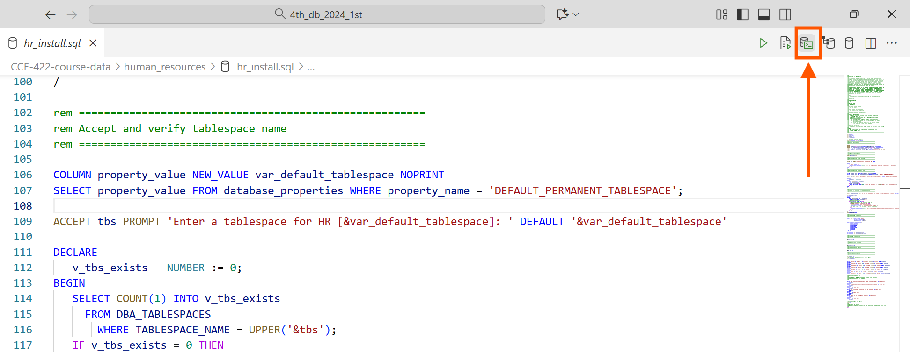

# Human Resources Sample Schema

```
Copyright (c) 2023 Oracle and/or its affiliates. All rights reserved.

Permission is hereby granted, free of charge, to any person obtaining a
copy of this software and associated documentation files (the "Software"),
to deal in the Software without restriction, including without limitation
the rights to use, copy, modify, merge, publish, distribute, sublicense,
and/or sell copies of the Software, and to permit persons to whom the
Software is furnished to do so, subject to the following conditions:

The above copyright notice and this permission notice shall be included in
all copies or substantial portions rem of the Software.

THE SOFTWARE IS PROVIDED "AS IS", WITHOUT WARRANTY OF ANY KIND, EXPRESS OR
IMPLIED, INCLUDING BUT NOT LIMITED TO THE WARRANTIES OF MERCHANTABILITY,
FITNESS FOR A PARTICULAR PURPOSE AND NONINFRINGEMENT. IN NO EVENT SHALL
THE AUTHORS OR COPYRIGHT HOLDERS BE LIABLE FOR ANY CLAIM, DAMAGES OR OTHER
LIABILITY, WHETHER IN AN ACTION OF CONTRACT, TORT OR OTHERWISE, ARISING
FROM, OUT OF OR IN CONNECTION WITH THE SOFTWARE OR THE USE OR OTHER
DEALINGS IN THE SOFTWARE.
```

## Description

Human Resources `(HR)` is a small sample schema resembling an HR department.

### Schema Version

21.1

### Release Date

03-FEB-2022

### Supported with Database Versions

19c and higher

### Major Changes in this Release

1. All DATE data is updated
2. Updated phone numbers in US for globalization
3. Regions are updated
4. Countries are updated: replaced `UK United Kingdom` with `GB United Kingdom of Great Britain and Northern Ireland`
5. `country_name` column changed from `varchar2(40)` to `varchar2(60)`
6. New install mechanism

### Schema Dependencies and Requirements

Required access to `hr_install.sql`, `hr_create.sql`, `hr_populate.sql`, `hr_code.sql`

## Install Instructions

1. Connect as privileged user with rights to create another user (`SYSTEM`, `ADMIN`, etc.)
2. Run the `hr_install.sql` script to create the `HR` (Human Resources) schema
3. You are prompted for:
    1. `password` - enter an Oracle Database compliant password
    2. `tablespace` - if you do not enter a tablespace, the default database tablespace is used

**Note:** If the HR schema already exists, it is removed/dropped and 
        a fresh HR schema is installed

## vscode installation


## Uninstall Instructions

1. Connect as privileged user with rights to create another user (`SYSTEM`, `ADMIN`, etc.)
2. Run the `hr_uninstall.sql ` script to remove the `HR` (Human Resources) schema

## Notes

Scripts need to be run as a privileged user with rights to create and drop another user (`SYSTEM`, `ADMIN`, etc.).
